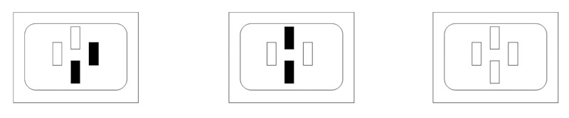

# Summary
To demonstrate the putative affect-reducing effect of the clinical method lateral eye movement (EMD) in the normal range an experiment was conducted. It is assumed that arousal reduction and mood elevation compared to other types of distractions are significant. An emotionally colored excitement was generated experimentally, followed by lateral eye movement and two variants of distraction. Before and after the treatment, arousal and subjectively experienced mood of subjects was measured.
Results suggest an effect in arousal reduction compared to distraction in general and to a specific distraction condition in particular. There were no effects on the subjectively perceived mood.
# Statement of need
The method of 'Eye Movement Desensitization' (EMD) was developed by Francine Shapiro in 1989 to treat post-traumatic stress disorder (PTSD). According to @DSM-III-R:1987 PTSD is defined by (a) constant reliving of a traumatic experience, (b) avoidance of thoughts about that situation and (c) an associated increased level of arousal.
@Shapiro:1989 describes the process of treating PTSD with EMD as follows: At the beginning, the client should visualize the traumatic event as vividly and in as much detail as possible. Then the therapist moves his finger rhythmically from right to left at a distance of 30 cm from the client's head and with a deflection of 30 cm, with a pendulum movement per second. During the imagining of the traumatic event, the patient generally follows the therapist's finger with his eyes until the imaginings become bearable. The length of such a set is given as 15 to 25 lateral eye movements. A stable effect was reported in a follow-up after three months.
As explaination how EMD works, @Shapiro:1989 refers to the fact that experiencing a traumatic event disturbs the balance between excitation and inhibition in the brain [@Pavlov:1929]. According to Shapiro the lateral eye movements should be able to restore this balance. The advantage of this method is seen in the fact that the treatment with EMD is very short and the client is not exposed to intense fear for a long time.
 @Vaughan:1994 first examined the effect of EMD on the major symptom groups of PTSD and found that all three categories of PTSD (see above) as well as depression were significantly improved. At a follow-up, however, only the categories “re-experiencing” and “avoidance” were significant; arousal and depression had increased again. It is suggested that, in order to further examine the mode of action of the EMD, the question should primarily be investigated as to whether fixing a stable target alone or any other form of distraction would not have the same effect.
The aim of the present study was to experimentally induce an emotionally colored arousal, one of the three symptom groups of PTSD, and investigating whether lateral eye movements reduce this activation more than (a) fixing a stable target or (b) a different kind of distraction. Arousal was achieved by the sbj. placed in a situation triggering evaluation anxiety. It was found that evaluation anxiety and arousal levels are significantly positively correlated. Furthermore, results of a study on 'social facilitation' and 'social monitoring' also point to such a relation [Guerin:1983].
In order to exclude suspected placebo effects, arousal was measured indirectly via short-term memory [@Walker:1958; @Kesner:1973]. 
# Treatment
A PC was placed to the right of the subject, and a camera on a tripod to the left\autoref{fig:procedure}, in order to maintain  the intended anxiety-provoking situation. 
In order to make eye movements imperceptible to subjects, a moving bar was displayed on a monitor \autoref{fig:treatment2}. The bar changed color from green to blue with a probability of $p=0.13$ per pass. Each blue bar was to be reported as 'blue' in order to disguise the real purpose. One run from left to right and back lasted $s=3$ seconds for $t=60$ runs resulting in a $m=3$ minute treatment.
In order to fix a central object, four rectangles were displayed \autoref{fig:treatment2}. These appeared either blue or green every $s=3$ seconds independently ($p=0.50%$). As soon as all four rectangles displayed the same color ($p=0.13$), subject had to react ('blue' or 'green'). Duration of the procedure was $m=3$ minutes. @EMDA was implemented in QBasic for Microsoft DOS 6.0 to perform treatment procedures and timing. A further program [@EMDapk] was created for handheld Android operating systems, performing treatment part 1 (moving bar to induce EMD) with selectabe speed for use in the field.
# Figures

# References
