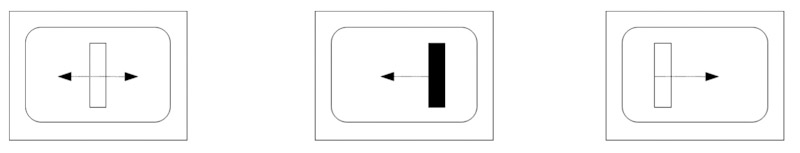

# Summary
To investigate the putative affect-reducing effect of the clinical method lateral eye movement (EMD) an experimental treatment was performed by means of @EMDA. Assuming that arousal reduction and mood elevation compared to other types of distractions are significant, an emotionally colored arousal was generated, followed by lateral eye movement and two variants of distraction. Results from EMDA treatment suggest an effect in arousal reduction compared to distraction in general and to a specific distraction condition in particular. 
# Statement of need
The method of 'Eye Movement Desensitization' (EMD) was developed by Francine Shapiro in 1989 to treat Post-Traumatic Stress Disorder (PTSD), see @APAGD:2019, @Merians:2023. According to DSM [@APA:2013] PTSD is defined by (a) constant reliving of a traumatic experience, (b) avoidance of thoughts about that situation and (c) an associated increased level of arousal.
@Shapiro:1989 describes the process of treating PTSD with EMD as follows: At the beginning, the client should visualize the traumatic event as vividly and in as much detail as possible. Then the therapist moves his finger rhythmically from right to left at a distance of $d=30$ cm from the client's head and with a deflection of again $d=30$ cm, with a pendulum movement per second. During the imagining of the traumatic event, the patient generally follows the therapist's finger with his eyes until the imaginings become bearable. The length of such a set is given as $n=15$ to $n=25$ lateral eye movements. A stable effect was reported in a follow-up after three months.
As neurophysiological explaination, Shapiro refers to the fact that experiencing a traumatic event disturbs the balance between excitation and inhibition in the brain [@Pavlov:1927] and lateral eye movements should be able to restore this balance. For further neurophysiological approaches see e.g. @Stickgold:2002,  @Söndergaard:2008, @Pierce:2021 or @Fernandez:2023.
The advantage of the method is clearly in the fact that treatments are rather short and so clients are not exposed to intense fear for a longer period of time [@Shapiro:1996]. @Vaughan:1994 first examined the effect of EMD on the major symptom groups of PTSD and found that all three categories of PTSD as well as depression were significantly improved.
The aim of this research by means of @EMDA procedure was to induce an emotionally colored arousal, one of the three symptom groups of PTSD, and investigating whether lateral eye movements reduces this activation more than (a) fixing a stable target or (b) a different kind of distraction, see [@Schrausser:1994; @Schrausser:2009]. Arousal was achieved by subjects placed in a situation triggering evaluation-anxiety, as this was found significantly positively correlated with arousal levels [@Guerin:1983]. 
Meanwhile, the value of Shapiro's method (EMD, EMDR, res.) has received broad confirmation and acceptance. In a meta-analysis [@Yunitri:2023], EMDR proved itself to be most effective in the treatment of PTSD compared to several other forms of therapy, see e.g. @Shapiro:2002, @Greenwald:2010, @Oren:2012, @Brown:2016, or @Laliotis:2022. For an overview and outlook regarding the method, see @Luber:2009.
# EMDA Treatment
A moving bar was rendered on a monitor to make eye movements imperceptible to subjects \autoref{fig:treatment1}. Additionally a tripod-mounted video camera was placed to the left of the subjects left to maintain an anxiety-provoking situation. The moving bar changed color from green to blue with a probability of $p=0.13$ per pass. Each blue bar was to be reported as 'blue'. One run from left to right and back lasted for $s=3$ seconds each of $t=60$ runs, resulting in a $m=3$ minute treatment duration.
In order to fix the central object, four rectangles were rendered on the screen \autoref{fig:treatment2}. These rectangles appeared either blue or green every $s=3$ seconds ($p=0.50%$). As soon as all four rectangles displayed the same color ($p=0.13$), subject again had to react ('blue' or 'green'). Duration of the procedure again was $m=3$ minutes. 
# Software
@EMDA is implemented in QBasic for Microsoft DOS 6.0 to perform treatment procedures and timing. Further programs @EMDapk for handheld Android operation systems versions 4.0 or later see @Alulema:2014 and @EMDscr as screensaver or executable for Microsoft Windows platforms are created. Both applications performing treatment part 1 described above, that is the moving bar in green color to induce the EMD, this with selectabe speed for use in the field.
# Conclusion
On the basis of the proven and broadly confirmed positive effects of EMD, respectively EMDR,  @EMDA represents a useful basis for further development and adaptation. This both in the experimental field and in the area of ​​application. This applies for the latter in particular to the extractions @EMDapk and @EMDwin, which are not only useful for quick and comfortable application but may be even more appropriate for further development of the source.
# Acknowledgement
We acknowledge contributions from the psychology students at the Karl-Franzens University, who acted as subjects as part of their education during the genesis of this project.
# Figures

# References
